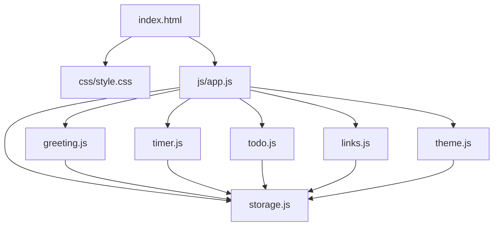
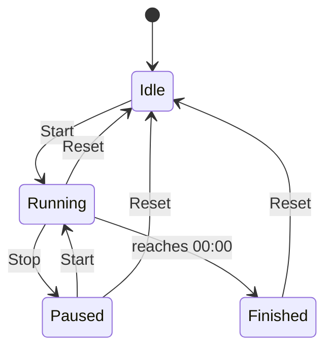

# Design Document

## Overview

The personal dashboard is a single-page web application built with plain HTML, CSS, and Vanilla JavaScript. It runs entirely in the browser with no backend — all state is persisted via the `localStorage` API. The app is composed of four independent widgets: a Greeting Widget, a Focus Timer, a To-Do List, and a Quick Links panel. Two optional features (light/dark theme and custom name) are integrated into the Greeting Widget and the overall layout.

The architecture follows a simple module pattern: each widget owns its own DOM subtree, its own state, and its own `localStorage` key(s). A thin shared utility layer handles storage reads/writes and time formatting. There is no framework, no build step, and no network requests.

---

## Architecture



All modules are plain ES modules loaded via `<script type="module">` in `index.html`. Each module exports an `init()` function called by `app.js` on `DOMContentLoaded`.

### File Structure

```
index.html
css/
  style.css
js/
  app.js          ← entry point, calls init() on each module
  greeting.js     ← Greeting Widget + custom name
  timer.js        ← Focus Timer + configurable duration
  todo.js         ← To-Do List + duplicate prevention + sorting
  links.js        ← Quick Links panel
  storage.js      ← thin wrapper around localStorage
  theme.js        ← light/dark toggle
```

---

## Components and Interfaces

### storage.js

```js
// Read a value from localStorage; returns null if absent
function load(key: string): any | null

// Write a JSON-serializable value to localStorage
function save(key: string, value: any): void
```

Storage keys used across the app:

| Key | Type | Owner |
|---|---|---|
| `pd_userName` | `string` | greeting.js |
| `pd_timerDuration` | `number` (minutes) | timer.js |
| `pd_tasks` | `Task[]` | todo.js |
| `pd_sortOrder` | `"default" \| "incomplete" \| "completed"` | todo.js |
| `pd_links` | `Link[]` | links.js |
| `pd_theme` | `"light" \| "dark"` | theme.js |

---

### greeting.js

Responsibilities: display time (updated every minute), display date, compute greeting phrase, render custom name, persist name.

Public interface:
```js
function init(): void   // mounts widget, starts clock interval
```

Internal helpers:
```js
function getGreetingPhrase(hour: number): string
// hour in [0,23] → "Good morning" | "Good afternoon" | "Good evening" | "Good night"

function formatTime(date: Date): string   // → "HH:MM"
function formatDate(date: Date): string   // → "Monday, July 14, 2025"
```

---

### timer.js

Responsibilities: countdown display, start/stop/reset controls, duration input, persist duration, notification on completion.

Public interface:
```js
function init(): void
```

Internal state:
```js
{
  durationMinutes: number,   // 1–90, persisted
  remainingSeconds: number,
  intervalId: number | null  // null when paused/stopped
}
```

Control state machine:



---

### todo.js

Responsibilities: add/edit/delete tasks, toggle completion, duplicate detection (case-insensitive), sort, persist.

Public interface:
```js
function init(): void
```

Internal helpers:
```js
function isDuplicate(label: string, tasks: Task[], excludeId?: string): boolean
function sortTasks(tasks: Task[], order: SortOrder): Task[]
function renderTask(task: Task): HTMLElement
```

---

### links.js

Responsibilities: add/delete links, URL validation, open in new tab, persist.

Public interface:
```js
function init(): void
```

Internal helpers:
```js
function isValidUrl(url: string): boolean
```

---

### theme.js

Responsibilities: toggle light/dark class on `<body>`, persist preference, apply on load.

Public interface:
```js
function init(): void
function toggle(): void
```

---

## Data Models

### Task

```ts
interface Task {
  id: string;          // crypto.randomUUID() or Date.now().toString()
  label: string;       // non-empty, trimmed
  completed: boolean;
  createdAt: number;   // Date.now() — used for "default" sort order
}
```

### Link

```ts
interface Link {
  id: string;
  label: string;   // non-empty, trimmed
  url: string;     // must pass URL validation
}
```

### SortOrder

```ts
type SortOrder = "default" | "incomplete" | "completed";
```

### Theme

```ts
type Theme = "light" | "dark";
```

---

## Correctness Properties

*A property is a characteristic or behavior that should hold true across all valid executions of a system — essentially, a formal statement about what the system should do. Properties serve as the bridge between human-readable specifications and machine-verifiable correctness guarantees.*

### Property 1: Greeting phrase covers all hours

*For any* integer hour in [0, 23], `getGreetingPhrase(hour)` SHALL return exactly one of "Good morning", "Good afternoon", "Good evening", or "Good night", and the mapping SHALL be exhaustive with no hour left unclassified.

**Validates: Requirements 1.3, 1.4, 1.5, 1.6**

---

### Property 2: Greeting phrase with name

*For any* non-empty User_Name string and any hour in [0, 23], the rendered greeting text SHALL equal `"[phrase], [User_Name]!"` where `[phrase]` is the result of `getGreetingPhrase(hour)`.

**Validates: Requirements 2.2**

---

### Property 3: Empty name produces no suffix

*For any* greeting phrase, when the User_Name is the empty string (or whitespace-only), the rendered greeting SHALL equal the bare phrase with no name suffix.

**Validates: Requirements 2.3**

---

### Property 4: Storage round-trip for User_Name

*For any* non-empty User_Name string, saving it via `save("pd_userName", name)` and then loading it via `load("pd_userName")` SHALL return the original string unchanged.

**Validates: Requirements 2.4, 2.5**

---

### Property 5: Timer duration validation

*For any* integer input `d`, the timer SHALL accept `d` if and only if `1 ≤ d ≤ 90`; any value outside that range SHALL be rejected and the previous valid duration SHALL be retained.

**Validates: Requirements 4.1, 4.3**

---

### Property 6: Storage round-trip for timer duration

*For any* valid duration `d` in [1, 90], saving it and reloading the page SHALL restore the timer to `d` minutes.

**Validates: Requirements 4.4, 4.5**

---

### Property 7: Adding a task grows the list

*For any* task list and any non-empty, non-duplicate task label, adding the task SHALL increase the list length by exactly one and the new task SHALL appear in the list with `completed = false`.

**Validates: Requirements 5.2**

---

### Property 8: Empty or whitespace task labels are rejected

*For any* string composed entirely of whitespace (including the empty string), attempting to add it as a task label SHALL be rejected and the task list SHALL remain unchanged.

**Validates: Requirements 5.3**

---

### Property 9: Task completion toggle is an involution

*For any* task, toggling its completion state twice SHALL return it to its original state.

**Validates: Requirements 5.4**

---

### Property 10: Duplicate task labels are rejected (case-insensitive)

*For any* existing task list and any new label whose case-insensitive form matches an existing task's label, the add operation SHALL be rejected and the list SHALL remain unchanged.

**Validates: Requirements 6.1**

---

### Property 11: Duplicate edit labels are rejected (case-insensitive)

*For any* task being edited, if the new label's case-insensitive form matches a *different* existing task's label, the edit SHALL be rejected and the task's label SHALL be restored to its original value.

**Validates: Requirements 6.2**

---

### Property 12: Sort order — incomplete first

*For any* task list sorted with "Incomplete first", all tasks with `completed = false` SHALL appear before all tasks with `completed = true`.

**Validates: Requirements 7.2**

---

### Property 13: Sort order — completed first

*For any* task list sorted with "Completed first", all tasks with `completed = true` SHALL appear before all tasks with `completed = false`.

**Validates: Requirements 7.3**

---

### Property 14: Sort order — default preserves insertion order

*For any* task list sorted with "Default", the relative order of tasks SHALL match their `createdAt` ascending order (i.e., insertion order).

**Validates: Requirements 7.4**

---

### Property 15: Storage round-trip for tasks

*For any* task list, serializing it to localStorage and deserializing it SHALL produce a list equal to the original (same ids, labels, completion states, and order).

**Validates: Requirements 5.9**

---

### Property 16: Valid URL acceptance

*For any* string that is a syntactically valid URL (parseable by `new URL()`), `isValidUrl` SHALL return `true`.

**Validates: Requirements 8.2**

---

### Property 17: Invalid URL rejection

*For any* string that is not a syntactically valid URL, `isValidUrl` SHALL return `false`, and the link SHALL not be added.

**Validates: Requirements 8.4**

---

### Property 18: Storage round-trip for links

*For any* links list, serializing it to localStorage and deserializing it SHALL produce a list equal to the original (same ids, labels, and URLs).

**Validates: Requirements 8.6**

---

### Property 19: Theme toggle is an involution

*For any* current theme, toggling twice SHALL return to the original theme.

**Validates: Requirements 9.2**

---

### Property 20: Storage round-trip for theme

*For any* theme value ("light" or "dark"), saving it and reloading SHALL restore that theme.

**Validates: Requirements 9.3**

---

## Error Handling

| Scenario | Handling |
|---|---|
| `localStorage` unavailable (private browsing, quota exceeded) | `storage.js` wraps calls in try/catch; app degrades gracefully — widgets still function in-memory for the session |
| Invalid timer duration input | Reject silently, restore previous value; optionally show inline validation message |
| Empty task label on add | Reject; show inline error |
| Duplicate task label | Reject; show inline error "A task with this name already exists" |
| Empty link label or invalid URL | Reject; show inline error |
| Timer reaches 00:00 | Stop interval, show visual notification (e.g., flash or banner); optionally play a short beep via `AudioContext` |

---

## Testing Strategy

### Unit Tests (example-based)

Use a lightweight test runner (e.g., [uvu](https://github.com/lukeed/uvu) or plain `assert` in Node) for pure functions:

- `getGreetingPhrase(hour)` — one example per time band boundary
- `formatTime(date)` — midnight, noon, single-digit minutes
- `formatDate(date)` — known date → expected string
- `isDuplicate(label, tasks)` — exact match, case-insensitive match, no match
- `sortTasks(tasks, order)` — each of the three sort orders
- `isValidUrl(url)` — valid http/https URLs, invalid strings, empty string
- Timer control state transitions — start → running, stop → paused, reset → idle

### Property-Based Tests

Use [fast-check](https://github.com/dubzzz/fast-check) (JavaScript PBT library) with a minimum of 100 iterations per property.

Each test is tagged with a comment in the format:
`// Feature: personal-dashboard, Property N: <property text>`

Properties to implement as property-based tests:

| Property | fast-check arbitraries |
|---|---|
| 1 — Greeting phrase covers all hours | `fc.integer({ min: 0, max: 23 })` |
| 2 — Greeting phrase with name | `fc.integer({ min: 0, max: 23 })`, `fc.string({ minLength: 1 })` |
| 3 — Empty name produces no suffix | `fc.constantFrom("", "   ", "\t")` |
| 4 — Storage round-trip for User_Name | `fc.string({ minLength: 1 })` |
| 5 — Timer duration validation | `fc.integer({ min: -100, max: 200 })` |
| 6 — Storage round-trip for timer duration | `fc.integer({ min: 1, max: 90 })` |
| 7 — Adding a task grows the list | `fc.array(taskArb)`, `fc.string({ minLength: 1 })` |
| 8 — Empty/whitespace labels rejected | `fc.stringOf(fc.constantFrom(" ", "\t", "\n"))` |
| 9 — Toggle completion is involution | `taskArb` |
| 10 — Duplicate add rejected | `fc.array(taskArb, { minLength: 1 })` |
| 11 — Duplicate edit rejected | `fc.array(taskArb, { minLength: 2 })` |
| 12 — Sort incomplete first | `fc.array(taskArb)` |
| 13 — Sort completed first | `fc.array(taskArb)` |
| 14 — Sort default preserves insertion order | `fc.array(taskArb)` |
| 15 — Storage round-trip for tasks | `fc.array(taskArb)` |
| 16 — Valid URL accepted | `fc.webUrl()` |
| 17 — Invalid URL rejected | `fc.string()` filtered to non-URLs |
| 18 — Storage round-trip for links | `fc.array(linkArb)` |
| 19 — Theme toggle involution | `fc.constantFrom("light", "dark")` |
| 20 — Storage round-trip for theme | `fc.constantFrom("light", "dark")` |

### Integration / Smoke Tests

- Load `index.html` in a headless browser (e.g., Playwright) and verify:
  - All four widgets render without JS errors
  - `localStorage` keys are written after user interactions
  - Theme class is applied to `<body>` on load
  - Timer counts down and stops at 00:00
